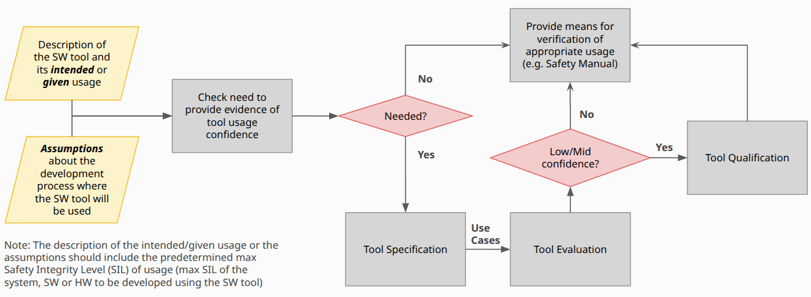
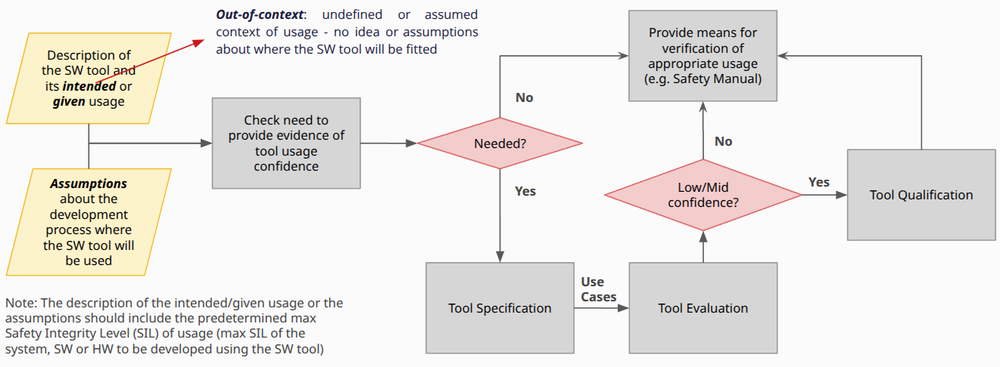
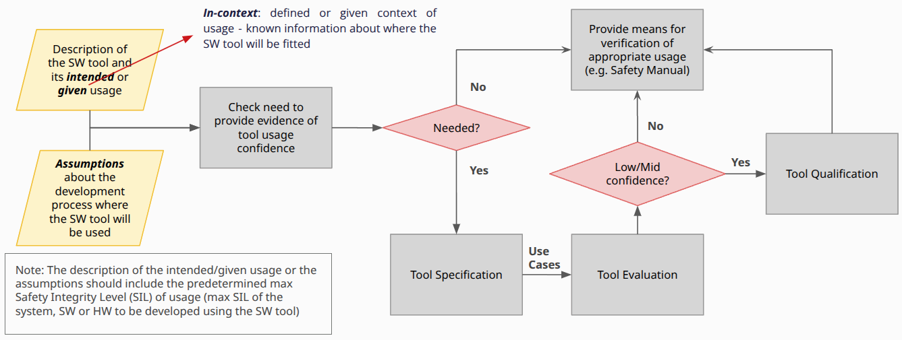
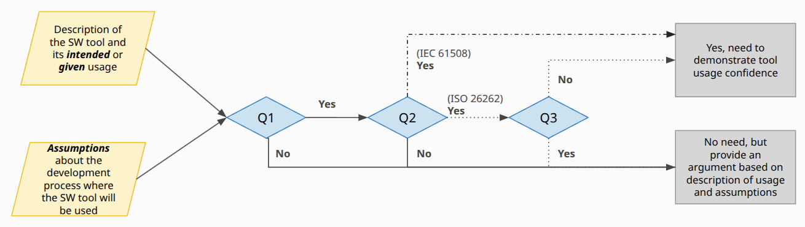
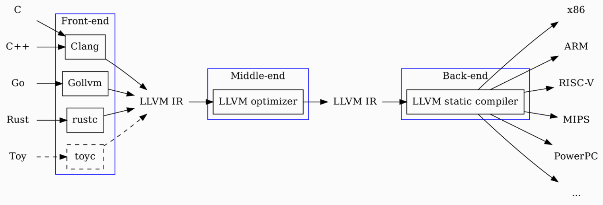

# LLVM Qualification Working Group - September 2025

- Sync-up meeting #3
- Focus: _Directions for a grey-box validation approach_

## Technical topics: Directions for a grey-box validation approach

### Confidence in the usage of software tools

_**References**_
- IEC 61508 Part 3 - Annex H__
- ISO 26262 Part 8 - Chapter 11

See also slides 11 to 14 in AsiaLLVM 2025’s [presentation](https://llvm.org/devmtg/2025-06/slides/technical-talk/urribarri-automotive.pdf)

### Need to provide evidence of tool usage confidence

| Question | Description |
| -------- | ----------- |
| **Q1 - Is the software tool used to support a safety-related activity or task?** | Does the the software tool play a role in executing any of the required activities or tasks defined by the reference safety standard (IEC 61508, EN 50128, ISO 26262…) standard for systems, hardware, or software? e.g., safety analysis, design, implementation, verification, testing and validation tasks, requirements management, configuration management, change management, overall safety management. |
| **Q2 - Does the activity or task rely on the correct functioning of the software tool?** | Is there a dependency of any of the activities or tasks on the accurate operation of the software tool? Does the successful completion of the activity or task hinge on the software tool performing its functions correctly? If the correct functioning of the tool is vital, some malfunctions or errors could compromise the safety of the final developed system, hardware, or software. Understanding this dependency is important to identify, at an early stage of the tool's development what are the high-level potential risks and implications of tool failures on crucial activities or tasks, contingency plans to address potential tool malfunctions and ensure continuity of operations, and the necessity for rigorous testing / validation of the tool. |
| **(Optional) Q3 - Are the relevant outputs completely/thoroughly/sufficiently examined or verified for the applicable process step(s)?** | For example: by reviews, checks, or verification procedures in place to assess the quality (i.e., completeness, correctness, consistency) of the relevant outputs produced by the software tool. Or, do you foresee any chance that some errors in the outputs of the tool will remain undetected by subsequent verifications or examination? Understanding this is important to identify the effectiveness of existent verification procedures to detect potential issues in the relevant outputs early, allowing for corrective actions to be taken before they escalate into significant problems, and reducing the likelihood of errors affecting subsequent steps in the development process of the system, hardware, or software developed with the software tool. |

### Classical tool qualification approach

Several qualification methods exist, but commonly done through **a mix of two methods**:

1. **Validation of the software tool** → Usually a **black-box testing approach**
2. **Evaluation of the tool development process** → Audit

The outcome is usually a _**Qualification Kit**_ or _**Safety Manual**_

- Defines assumptions of use, limitations, known issues
- Provides evidence (validation strategy, test reports, coverage, audit results)

Users (OEMs, Tier1s,...) must integrate this kit into their own _**safety case**_, showing that the tool’s assumptions and restrictions align with their project

### Limitations of the classical approach, for open source

- Vendor-provided qualification kits are difficult to deploy in open source due to licenses
- Analysis of all known issues might not align well with modern open-source ecosystems that evolve quickly
  - For example, new versions are released every six months
  - This makes it difficult to test and document all that is needed for a qualification process
  - One potential solution to this is to work on a Long Term Support (LTS) version
- When the software tool is very complex with a high impact in safety-critical development (such as compilers), a black-box testing approach might not be fully adapted to ensure high confidence / high quality
  - Black-box approach could be too high-level
  - No high assurance about internal processing logic, only from initial inputs to final outputs
  - No high assurance on what is happening in intermediate steps

### Three stages of compiler design

### Tool qualification approach for LLVM in open source

1. **Validation of the software tool**
   - **White-box is not practical or achievable → Unrealistic**
     - Complexity of LLVM components is very high
     - No full specification
     - High configurability
   - **Grey-box approach**
     - Partial insights: neither fully open nor fully closed
     - Visibility into how the components are designed without revealing every operational detail
     - Even if internal logic and workings remain complex, having a look to intermediate steps can foster more trust and accountability
     - Increase error prevention & detection for each step (front-end, middle-end, back-end,…)
   Use classical and non-classical verification methods
     - Classical: test kits, reviews…
       - Challenge: not currently possible to claim Clang conformance by tests in open source
     - Non-classical (in tool qualification): formal verification for the middle-end and back-ends…
       - Challenge: need of sponsors to improve and extend these methods and tools, technical limitations
     - Others?
2. **Evaluation of the tool development process**
   - Open Audit of the OSS project’s quality management and process
     - Challenge: resources for monitoring the project’s quality and for applying corrective actions
     - Using Good Quality / Best Practices in Open Source Standard (Lighthouse SIG in ELISA) might be a starting point (but it’s under definition / initial stages)
   - Extend the definition to take into consideration human-factors metrics for defect prediction
     - Challenge: time that it takes for triage, root-cause analysis, documenting issues, adding in issue tracker…
   - Others?

+Other subjects not yet explored → Pieces of the confidence-in-use puzzle

Should we change our initial focus (Clang conformance)?

How do we want to proceed?

## Non-technical topics: Miscellaneous

### AI auto-transcriptions: Any concerns?

**Benefits**

- Easier to follow complex discussions.
- Helpful aid for non-native English speakers.
- Frees up note-takers.
- https://discourse.llvm.org/t/ai-transcripts-in-llvm-working-groups-gemini-for-note-taking/88075

**Consultation**

- Do we want to continue enabling AI auto-transcription (currently with Gemini)? If yes, by default?
- Do you have any concerns? For example, about names appearing in transcripts or minutes.

**Policy (draft)**
- If there’s broad agreement, we could formally adopt a policy and add it to the WG’s rules. It may also serve as a reference for other LLVM WGs.
- https://mypads2.framapad.org/p/ai-transcription-policy-qwfql9cu

### Newly submitted self-nomination for membership

⚠️ Reminder: [Description of Active Members](https://mypads2.framapad.org/p/group-composition-pqp2g9zl) ⚠️

**Timezone**: Asia/Jakarta (GMT+7)__
**Affiliation**: None (coming as an individual)__
**Job**:
- Developer & Security Engineer
- Final year undergraduate EE student working on a government project on verification and standardization for cars 
- Experience working as a C++ software engineer and likes compilers
**Interests related to the WG**: Sanitizers, fuzzers__
**Potential contributions**: Participating in technical discussions, helping with documentation

### Communications: Opinions from the WG?

1. **Oscar’s idea for the [US LLVM 2025](https://hotcrp.llvm.org/usllvm2025/) conference (Santa Clara)**
- Proposal: Having an official “Tool qualification” corner
- Goal: Get visibility, contact with interested people
- To be considered
  - The WG just started recently
  - Not overstating where we are
  - No tangible outputs yet
2. **[Eclipse SDV](https://sdv.eclipse.org/) (Eclipse Foundation)**
  - Open source tooling in safety domain is one of their topics
  - Thus, they have an interest in the LLVM open qualification initiative
  - Invitation to their [community meetup in Japan](https://www.eventbrite.com/e/eclipse-sdv-community-meetup-japan-co-hosted-by-bosch-group-tickets-1540218427779)
  - Invitation to give a talk about the LLVM initiative
  - Contact person: Director of the SDV Ecosystem Development
3. **Poster at [Innovations in Compiler Technology](https://compilertech.org/)** (Bangalore)
  - _Practical Challenges in Upstream Open-Source Compiler Qualification_
  - Connect with researchers in compilers to explore new ideas for the WG
4. **Insights from a conversation with an ELISA project member on resources & funding**
  - Do we want to have funding for activities related to the WG? Examples:
    - Development of a Clang C/C++ conformance test kit in open source
    - Supporting research on translation validation tools for middle-end and back-ends
  - Workshops? Conference participation? Infrastructure?
  - Show some good early results first?
  - Investing time within the WG is already a form of financing

### Backlog (not in the initial agenda)

- Carlos proposed a first draft
- https://github.com/llvm/llvm-project/pull/156184
- Need of opinions from the WG members
- Before merge
  - Review contents
  - Store in a Google Docs file instead? (Kristof’s review remark)

### Safety Transparency Policy (not in the initial agenda)

- Carlos proposed a first draft
- https://mypads2.framapad.org/p/safety-transparency-policy-nigll9v3
- Opinions from the WG members?
- Discuss the topic on our Discord channel: [#fusa-qual-wg](https://discord.com/channels/636084430946959380/1389362444169773117)

## Open Discussion

Let's discuss any doubts or concerns.  
If something comes up later, contact the Working Group on Discourse or Discord.
