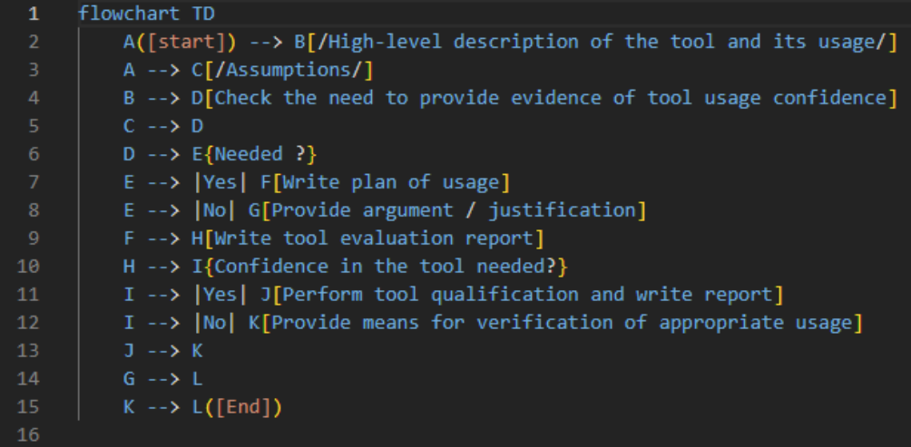
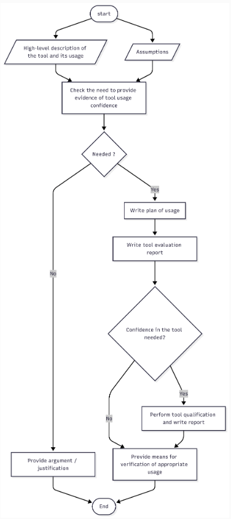
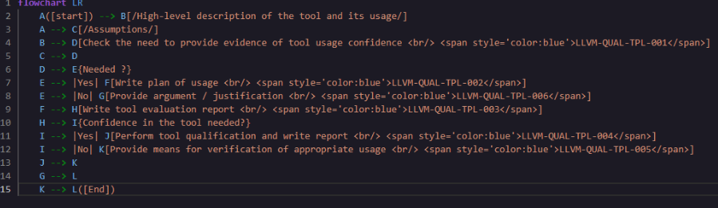
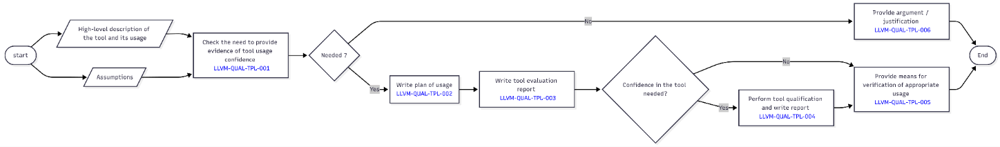
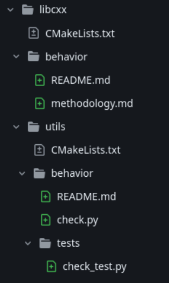

# LLVM Qualification Working Group - June 2026

- Sync-up meeting #12
- Focus: _Ongoing actions_

## Non-technical topics

### One year already!

The working group marked its first anniversary.

### Summary of last month's pull requests

Merged:
- \[QualWG\] Add initial working group directory: [#3](https://github.com/llvm/llvm-wgs/pull/3)

Open:
- Add `CODEOWNERS` for `fusa-qual-wg`: [#19](https://github.com/llvm/llvm-wgs/pull/19)

No write/merge permission yet in `llvm-wgs` - see [Where should WG meeting materials live?](https://discourse.llvm.org/t/where-should-wg-meeting-materials-live/88913)

Link to our docs: [LLVM Qualification Group](https://llvm.org/docs/QualGroup.html)

## Technical topics: Ongoing actions

### [Zaky] Mermaid conversion of workflows

With text format, we can easily see the diff, helps with PR review

Can also be styled, but it will make the code a little bit difficult to read.

### [Petter] Status of the libc / libc++ qualification enablement PoC

- PoC includes relevant examples for both libraries, the scripts necessary to run the code-to-tests traceability checks + reports, and documentation 
- Shared with libc and libc++ maintainers
- During our session, Petter can share his demo + the feedback received from the lib maintainers

### [Carlos] Status of safety model

- Progress done for several components
- Still to be reviewed and confirmed
- Document is here: [link](https://docs.google.com/spreadsheets/d/1ShQjRBoAVWmIxdLpLZQWPAiwgOsxZTwg5gkBqidiau0/edit?gid=0#gid=0)

### Topics raised by participants

## Open Discussion

Let's discuss any doubts or concerns.  
If something comes up later, contact the Working Group on Discourse or Discord.
