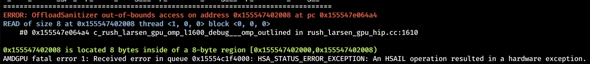

# Wednesday, July 10, 2024, 7:00 - 8:00 am PST

# Agenda

  256. Second PGO for GPU patches is ready, third under preparation

  1. [https://github.com/llvm/llvm-project/pull/76587](https://www.google.com/url?q=https://github.com/llvm/llvm-project/pull/76587&sa=D&source=editors&ust=1779820786989266&usg=AOvVaw0TN6B5D9AnFxzcW0PTVKBm)
  2. [https://github.com/llvm/llvm-project/pull/93365](https://www.google.com/url?q=https://github.com/llvm/llvm-project/pull/93365&sa=D&source=editors&ust=1779820786989495&usg=AOvVaw1krN-O6JUsN2Y4XBRNen31)

  257. GPU ASAN (alternative) prototype ready

  258. Performance monitoring

  1. [https://crpl.cis.udel.edu/lnt-sollve/](https://www.google.com/url?q=https://crpl.cis.udel.edu/lnt-sollve/&sa=D&source=editors&ust=1779820786989966&usg=AOvVaw1_63YP631hMfU0F_mj6sl2)
  2. [https://gitlab.e4s.io/uo-public/llvm-sollve/-/pipelines](https://www.google.com/url?q=https://gitlab.e4s.io/uo-public/llvm-sollve/-/pipelines&sa=D&source=editors&ust=1779820786990203&usg=AOvVaw35y5aqWIPEdWwtLYCZyWtk)

  1. Caught: [https://github.com/llvm/llvm-project/pull/96909](https://www.google.com/url?q=https://github.com/llvm/llvm-project/pull/96909&sa=D&source=editors&ust=1779820786990487&usg=AOvVaw3XroXKnBZMkkKglqK1hkAb)

  259. CUDA on LLVM/Offload

  1. [https://github.com/llvm/llvm-project/pull/94549](https://www.google.com/url?q=https://github.com/llvm/llvm-project/pull/94549&sa=D&source=editors&ust=1779820786990817&usg=AOvVaw36JL5EEcW8EcNb6274lN1G)
  2. [https://github.com/llvm/llvm-project/pull/94821](https://www.google.com/url?q=https://github.com/llvm/llvm-project/pull/94821&sa=D&source=editors&ust=1779820786991088&usg=AOvVaw1-fd2SZHpxru5LkgwYnCyA)
  3. [https://github.com/llvm/llvm-project/pull/95371](https://www.google.com/url?q=https://github.com/llvm/llvm-project/pull/95371&sa=D&source=editors&ust=1779820786991312&usg=AOvVaw2XgpneMofG15s5MTFlHRdR)

  260. Testing

  1. Keep a list of issues we discuss in the meetings
  2. Make 1-3 people the "bug keepers" (Joseph, Johannes)

  261. offload-tblgen

  1. [https://github.com/llvm/llvm-project/pull/88923](https://www.google.com/url?q=https://github.com/llvm/llvm-project/pull/88923&sa=D&source=editors&ust=1779820786991958&usg=AOvVaw051L-NFJy63Eghbazrx82q) (Please review)
  2. [https://gist.github.com/jhuber6/2117cfd03b7c78d91f5481ac63da682d](https://www.google.com/url?q=https://gist.github.com/jhuber6/2117cfd03b7c78d91f5481ac63da682d&sa=D&source=editors&ust=1779820786992237&usg=AOvVaw2HDc06egtoDyxG1gePLoeF)

  1. API draft Joseph typed up

  3. What are the next steps for introducing API changes?

  1. Design the entire new API before beginning to implement it? (By porting the existing plugins?)
  2. Move the existing plugins API to the tablegen framework and then introduce changes?
  3. Ignore the tablegen framework for now and change the existing plugin API directly?

  262. Parallel Thin LTO (WIP) [https://github.com/ggeorgakoudis/llvm-project/tree/hip-omp-parallel-thinlto-clean](https://www.google.com/url?q=https://github.com/ggeorgakoudis/llvm-project/tree/hip-omp-parallel-thinlto-clean&sa=D&source=editors&ust=1779820786993743&usg=AOvVaw0KRfAcXM2ntSiUR8VOqunI)
  263. Draft RFC on upstreaming the SYCL runtime with a short term dependency on UR

  1. [https://docs.google.com/document/d/1QI8opRuabWASxqe8Lu_dGLVO1dXlibzgBi_M-UEHxyw/edit?usp=sharing](https://www.google.com/url?q=https://docs.google.com/document/d/1QI8opRuabWASxqe8Lu_dGLVO1dXlibzgBi_M-UEHxyw/edit?usp%3Dsharing&sa=D&source=editors&ust=1779820786994321&usg=AOvVaw1gjnqPGFAP2qA9BscJ-WVb)
  2. Feedback welcome before the RFC is finished and shared

* * *

#
