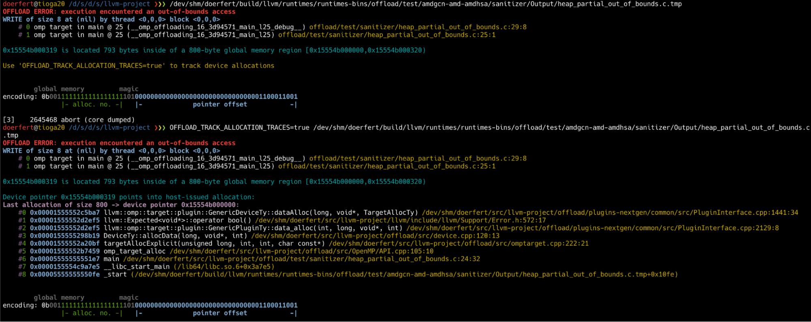
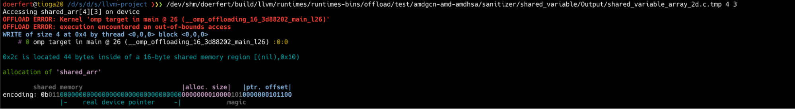
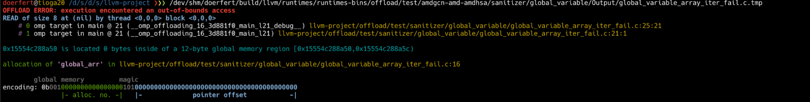

# Wednesday, Oct 16, 2024, 7:00 - 8:00 am PST

# Agenda

  196. Second PGO for GPU patches is ready, third under preparation

  1. [https://github.com/llvm/llvm-project/pull/93365](https://www.google.com/url?q=https://github.com/llvm/llvm-project/pull/93365&sa=D&source=editors&ust=1779820786956392&usg=AOvVaw08MQke788a9vqxXX98g5g9)

  197. GPU ASAN (alternative) prototype ready

  1. bad/double-free and kernel traces merged
  2. Testing out "new-new" design to avoid memory allocations/accesses all together

  198. Parallel Thin LTO (WIP) 

  1. Second try: [https://github.com/jdoerfert/llvm-project/tree/thin_lto](https://www.google.com/url?q=https://github.com/jdoerfert/llvm-project/tree/thin_lto&sa=D&source=editors&ust=1779820786957416&usg=AOvVaw1Lzn4qoel034AJLwqhNF2i)

  199. Performance monitoring

  1. [https://crpl.cis.udel.edu/lnt-sollve/](https://www.google.com/url?q=https://crpl.cis.udel.edu/lnt-sollve/&sa=D&source=editors&ust=1779820786957727&usg=AOvVaw3B5_PAYMByh32WaVW1mnkC)
  2. [https://gitlab.e4s.io/uo-public/llvm-sollve/-/pipelines](https://www.google.com/url?q=https://gitlab.e4s.io/uo-public/llvm-sollve/-/pipelines&sa=D&source=editors&ust=1779820786958001&usg=AOvVaw2bRxB9zF3hnuIeEvms1IHH)

  1. Caught: [https://github.com/llvm/llvm-project/pull/96909](https://www.google.com/url?q=https://github.com/llvm/llvm-project/pull/96909&sa=D&source=editors&ust=1779820786958246&usg=AOvVaw1nqU8Ssy24JSyGzUCWK1R2)

  200. CUDA on LLVM/Offload

  1. [https://github.com/llvm/llvm-project/pull/94821](https://www.google.com/url?q=https://github.com/llvm/llvm-project/pull/94821&sa=D&source=editors&ust=1779820786958566&usg=AOvVaw2L0DrVeTxgesW37hsKsBtF)
  2. [https://github.com/llvm/llvm-project/pull/95371](https://www.google.com/url?q=https://github.com/llvm/llvm-project/pull/95371&sa=D&source=editors&ust=1779820786958776&usg=AOvVaw0f3av-cXxjr9d05trXKeH4)

  201. Testing

  1. Keep a list of issues we discuss in the meetings
  2. Make 1-3 people the "bug keepers" (Joseph, Johannes)

  202. Initial PR for new API and tablegen tooling is up: [https://github.com/llvm/llvm-project/pull/108413](https://www.google.com/url?q=https://github.com/llvm/llvm-project/pull/108413&sa=D&source=editors&ust=1779820786959445&usg=AOvVaw2keNJ9-ilbTuexnrm_Y-a5) 

  1. New updates (Oct 2nd):

  1. Generated files are checked in
  2. Error handling is improved
  3. Unit tests added

  2. Open items:

  1. Decide on naming convention (offloadFoo is too verbose, camel case vs snake case)
  2. API versioning (tied to LLVM version?)

  203. New RFC for SYCL upstreaming - [https://discourse.llvm.org/t/rfc-sycl-runtime-upstreaming-questions/80323](https://www.google.com/url?q=https://discourse.llvm.org/t/rfc-sycl-runtime-upstreaming-questions/80323&sa=D&source=editors&ust=1779820786960452&usg=AOvVaw2rUyRis6K9a0Ktj7I4D2i2)

* * *

#
