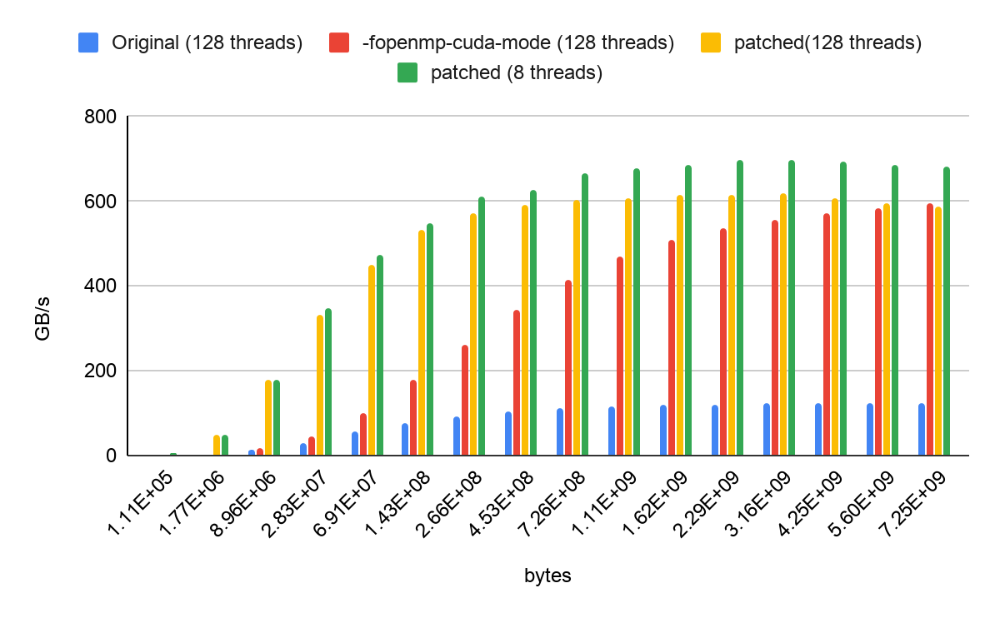

### 2020, August 26

### Agenda

  * Communicating OMP_TGT_MAPTYPE_LITERAL to plugins

  * Overload offset field by setting it to MAXINT to communicate literals

  * Search location of plugin libraries
  * Test update status 

  * Salyedul is waiting for 2 reviews.  Alexey will review the patches

  * Questions from Alex Duran on unshackled threads ([https://reviews.llvm.org/D77609](https://www.google.com/url?q=https://reviews.llvm.org/D77609&sa=D&source=editors&ust=1778600246605335&usg=AOvVaw0EFc6XCZk_YxSpPTsG1OPW))
  * Release Notes for OpenMP in LLVM/Clang 11, collected right now ([https://reviews.llvm.org/D86562](https://www.google.com/url?q=https://reviews.llvm.org/D86562&sa=D&source=editors&ust=1778600246605496&usg=AOvVaw3aUpt0q74aGM4aGUlezSSV))
  * Target memory manager (merged)
  * Pack  first private (merged)
  * Plugin lifetime
  * Emit more errors to users ([https://reviews.llvm.org/D86483](https://www.google.com/url?q=https://reviews.llvm.org/D86483&sa=D&source=editors&ust=1778600246605739&usg=AOvVaw2wf67Lgl3bJcHETSYKQjeK)) ([https://docs.google.com/document/d/1nvQANWODnsCszGLDdqsbNkQokOolxBVXlFfvk2tHxU4/edit?usp=sharing](https://www.google.com/url?q=https://docs.google.com/document/d/1nvQANWODnsCszGLDdqsbNkQokOolxBVXlFfvk2tHxU4/edit?usp%3Dsharing&sa=D&source=editors&ust=1778600246605893&usg=AOvVaw3Z_KQ0lxfvvEjaL-Q_7Ybu))
  * 

Target Memory Manager effect on SU(3)xSU(3) (grid mini app), it is patched below, includes the -fopenmp-cuda-mode flag in the plot:

### Open Bugs

  * 

### Patches to look at

  * [https://reviews.llvm.org/D77609](https://www.google.com/url?q=https://reviews.llvm.org/D77609&sa=D&source=editors&ust=1778600246606500&usg=AOvVaw1rOkSwD9Dm6x9jYc9o6Fge)
  * [https://reviews.llvm.org/D81054](https://www.google.com/url?q=https://reviews.llvm.org/D81054&sa=D&source=editors&ust=1778600246606593&usg=AOvVaw35YTFOK16VbyQBL8I22Wic) 
  * [https://reviews.llvm.org/D80816](https://www.google.com/url?q=https://reviews.llvm.org/D80816&sa=D&source=editors&ust=1778600246606681&usg=AOvVaw1Oo0TlMTKca3HYGpS-B5l_)

### Participants (voluntary/incomplete listing)

  * Ravi Narayanaswamy (Intel)
  * Jan Sjodin (AMD)
  * George Rokos (Intel)
  * Saiyedul Islam (AMD)
  * Johannes Doerfert (ANL)
  * Jon Chesterfield (AMD)
  * Andrey Churbanov (Intel)
  * Shilei Tian (SBU)
  * Valentin Clement (ORNL)
  * Joel Denny (ORNL)
  * Ye Luo (ANL)
  * Hal Finkel (ANL)
