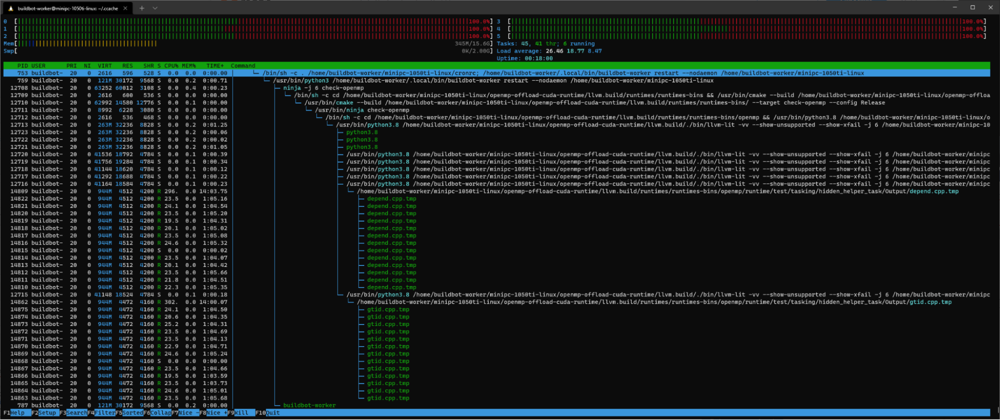

### 2021, July 28th

### Agenda

  * Reminder 13.0.0 release schedule from May 3 email.

July 27: release/13.x branch created

July 30: 13.0.0-rc1

Aug  24: 13.0.0-rc2

Sep   7: 13.0.0-rc3

Sep  21: 13.0.0-final

  * CMake for Ubuntu Offloading
  * Static library linking?

  * Waiting for last patch to be reviewed https://reviews.llvm.org/D105191

  * AMDGPU math headers

  * Offloading buildbot failures

  * llvm.org/PR50739 ; llvm.org/PR49940 [FLAKY]

  * FAIL: libomptarget :: nvptx64-nvidia-cuda::bug49334.cpp
  * FAIL: libomptarget :: x86_64-pc-linux-gnu::bug49334.cpp
  * [https://reviews.llvm.org/D104418](https://www.google.com/url?q=https://reviews.llvm.org/D104418&sa=D&source=editors&ust=1778600246528943&usg=AOvVaw1wzSVLQ7s0P9sZBaiXngM6) (under review)

  * llvm.org/PR50738; llvm.org/PR51150

  * FAIL: libomptarget :: x86_64-pc-linux-gnu::memory_manager.cpp
  * FAIL: libomptarget :: x86_64-pc-linux-gnu::parallel_offloading_map.cpp
  * FAIL: libomptarget :: x86_64-pc-linux-gnu::taskloop_offload_nowait.cpp

  * llvm.org/PR51233 [FLAKY] [NEW]

  * FAIL: libomptarget :: nvptx64-nvidia-cuda::bug50022.cpp

  * llvm.org/PR51235 [FLAKY] [NEW]

  * Regression test execution time increased from 1m20s to up to 23min
  * llvm.org/PR49066 2nd attachment might be related and a stable reproducer
  * [https://reviews.llvm.org/D107121](https://www.google.com/url?q=https://reviews.llvm.org/D107121&sa=D&source=editors&ust=1778600246529789&usg=AOvVaw15uafipl1w5MGfkHOA0cp4)

  * [openmp-offload-cuda-runtime](https://www.google.com/url?q=https://lab.llvm.org/staging/%23/builders/154&sa=D&source=editors&ust=1778600246529885&usg=AOvVaw1gs4SzND4wiQTFTRCg30YG) now built using ccache

  * Since https://lab.llvm.org/staging/#/builders/154/builds/1773
  * https://reviews.llvm.org/D106781

  * https://reviews.llvm.org/D106928

  * Device specific archive library

  * Llvm-link archive support? [https://reviews.llvm.org/D81109](https://www.google.com/url?q=https://reviews.llvm.org/D81109&sa=D&source=editors&ust=1778600246530246&usg=AOvVaw2_kCQmTGgCMrpV7xqhpgLz) (merged)
  * Unbundling of device specific archive from fat archive [https://reviews.llvm.org/D93525](https://www.google.com/url?q=https://reviews.llvm.org/D93525&sa=D&source=editors&ust=1778600246530393&usg=AOvVaw3rWYnjD64G8bCkA0nGKpl1) (merged)
  * [Clang][OpenMP] Add support for Static Device Libraries [https://reviews.llvm.org/D105191](https://www.google.com/url?q=https://reviews.llvm.org/D105191&sa=D&source=editors&ust=1778600246530570&usg=AOvVaw2T6AaNYm_G18mg7cud-cgl) (under review)

  * OMPT for omptarget ([https://reviews.llvm.org/D99803](https://www.google.com/url?q=https://reviews.llvm.org/D99803&sa=D&source=editors&ust=1778600246530725&usg=AOvVaw2kmKrH9nE2kUaDyyqYBgCD))
  * Libarcher in Ubuntu/Debian packages ([https://bugs.llvm.org/show_bug.cgi?id=45945](https://www.google.com/url?q=https://bugs.llvm.org/show_bug.cgi?id%3D45945&sa=D&source=editors&ust=1778600246530875&usg=AOvVaw3FutoZ94EyLN7rXLCdos76) issue with -Wl,-Bsymbolic-functions flag)
  * https://bugs.llvm.org/show_bug.cgi?id=51117 

  * pre-merge bot failing with libarcher failures: https://reviews.llvm.org/D105811  [https://reviews.llvm.org/harbormaster/unit/113491/](https://www.google.com/url?q=https://reviews.llvm.org/harbormaster/unit/113491/&sa=D&source=editors&ust=1778600246531181&usg=AOvVaw3NWtpdIVHo4S_T7jutILOI)
  * Fixed by D106855

  * Multiple architecture offload compilation

  * Generation of multi-image binary by clang and runtime's ability to load appropriate image: [[OpenMP] Multi architecture compilation support] [https://reviews.llvm.org/D106870](https://www.google.com/url?q=https://reviews.llvm.org/D106870&sa=D&source=editors&ust=1778600246531508&usg=AOvVaw0ek-ERMDLw_inij_191RrJ)
  * Query current offload architecture to find "appropriate image": [OffloadArch] Library to query properties of current offload archicture [https://reviews.llvm.org/D106960](https://www.google.com/url?q=https://reviews.llvm.org/D106960&sa=D&source=editors&ust=1778600246531720&usg=AOvVaw16_o-F250LlWKdVbcoiW3_)

### Open Bugs

  * [https://bugs.llvm.org/show_bug.cgi?id=49787](https://www.google.com/url?q=https://bugs.llvm.org/show_bug.cgi?id%3D49787&sa=D&source=editors&ust=1778600246531917&usg=AOvVaw1hOFnaJxRjBnn-xzMdZygk) compiler/runtime API mismatch for async mapping
  * [https://bugs.llvm.org/show_bug.cgi?id=50336](https://www.google.com/url?q=https://bugs.llvm.org/show_bug.cgi?id%3D50336&sa=D&source=editors&ust=1778600246532060&usg=AOvVaw0JMYBi3-NujpvOYr6dlKfJ) help needed

### Patches to look at

  * 

### Participants (voluntary/incomplete listing)

  * Jon Chesterfield (AMD)
  * Ravi Narayanaswamy (Intel)
  * Joseph Huber (ORNL)
  * Johannes Doerfert (ANL)
  * Roger Ferrer Ibañez (BSC)
  * Andrey Churbanov (Intel)
  * Saiyedul Islam (AMD)

###
