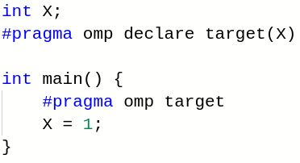

### 2022, Jan 19

### Agenda

  * Offloading driver update: [OpenMP Offloading Driver Update](https://www.google.com/url?q=https://docs.google.com/presentation/d/1QXKSdBWhLaUHyrI-dgd2yHMux3w_q2EF2sROyO0u52k/edit?usp%3Dsharing&sa=D&source=editors&ust=1778600246409131&usg=AOvVaw3pztmx6L0NGEq2aqRMWjcd)

  * [https://reviews.llvm.org/D116541](https://www.google.com/url?q=https://reviews.llvm.org/D116541&sa=D&source=editors&ust=1778600246409232&usg=AOvVaw1DEwxbx3FOItYrb2uf4JGa)
  * [https://github.com/jhuber6/llvm-project/tree/NewDriver](https://www.google.com/url?q=https://github.com/jhuber6/llvm-project/tree/NewDriver&sa=D&source=editors&ust=1778600246409352&usg=AOvVaw0LJm6AbsJ2nuTdQEa6_in9)

  * Old runtime broken on amdgpu at head (buildbot demoted to staging), plan of attack?

  * 

  * Exploring using Pre-Commit CI with OpenMP Phabricator reviews (talking with Louis Dionne)

  * LLVMdev '21: Pre-Commit CI in LLVM: A Case Study of Libc++ - Louis Dionne

  * [https://www.youtube.com/watch?v=kP8CPwaDm_U&t=1h40m15s](https://www.google.com/url?q=https://www.youtube.com/watch?v%3DkP8CPwaDm_U%26t%3D1h40m15s&sa=D&source=editors&ust=1778600246409771&usg=AOvVaw3ccZJ1IG-lFi7qxAfHqQ-y)
  * [https://buildkite.com/llvm-project](https://www.google.com/url?q=https://buildkite.com/llvm-project&sa=D&source=editors&ust=1778600246409875&usg=AOvVaw3QNfHwlfXf-QMlKkPhWcwB)

  * 12/15 status update:

  * Louis created a buildkite OpenMP "team" and invited Johannes & Michael Kruse
  * Mikhail Goncharov ([goncharov@google.com](mailto:goncharov@google.com)), who set up the BuildKite ⇔ Phabricator integration, now working with Michael Kruse on setting up builds & agents with GPUs: [https://github.com/google/llvm-premerge-checks/issues/368](https://www.google.com/url?q=https://github.com/google/llvm-premerge-checks/issues/368&sa=D&source=editors&ust=1778600246410348&usg=AOvVaw0GplQjY569CyPCdcsYUAn8)

  * 12/22 status update:

  * Dependencies for host-offloading added (libelf-dev), now running in pre-merge checks

  * Pre-merge check issues: [https://github.com/llvm/llvm-project/issues/53266](https://www.google.com/url?q=https://github.com/llvm/llvm-project/issues/53266&sa=D&source=editors&ust=1778600246410622&usg=AOvVaw0pTzsLhq5DFIE1KRAzXjDY)
  * With [https://reviews.llvm.org/D116906](https://www.google.com/url?q=https://reviews.llvm.org/D116906&sa=D&source=editors&ust=1778600246410730&usg=AOvVaw1Pz1zFAKagrbdkoq4WPP2E) all OvO test pass (O3) on MI100,

  * OpenMC on MI100 builds in unity build (sometimes)
  * What else is broken on AMD?

  * QMCPACK complex reduction
  * [https://github.com/llvm/llvm-project/issues/53290](https://www.google.com/url?q=https://github.com/llvm/llvm-project/issues/53290&sa=D&source=editors&ust=1778600246411018&usg=AOvVaw2tt-LTmjz39b59Y1vj5tNx)
  * Printf
  * 

  * JIT support

  * Prototype: [https://github.com/tianshilei1992/llvm-project/tree/jit-lto](https://www.google.com/url?q=https://github.com/tianshilei1992/llvm-project/tree/jit-lto&sa=D&source=editors&ust=1778600246411288&usg=AOvVaw1mhywjVOj_hC0D2Yht0eHy)
  * Optimization: kernel argument specialization, pointer alignment, # teams and # threads folding, # registers, readonly global specialization
  * Image caching
  * Portability: e.g. image of sm_35 but run on sm_75
  * Kernel time improvement: SU3 ~6.5%, XSBench ~8.27%, 503.postencil ~300%

  * Non-standard ompx OpenMP library 
  * GPU working group [https://lists.llvm.org/pipermail/llvm-dev/2022-January/154618.html](https://www.google.com/url?q=https://lists.llvm.org/pipermail/llvm-dev/2022-January/154618.html&sa=D&source=editors&ust=1778600246411822&usg=AOvVaw1gowctXksOUz12oHsDAtzj)
  * Interop directive

  * [https://reviews.llvm.org/D106674](https://www.google.com/url?q=https://reviews.llvm.org/D106674&sa=D&source=editors&ust=1778600246411983&usg=AOvVaw291FtyKzrbjFFr7RPJQvd0) (runtime)
  * [https://reviews.llvm.org/D105876](https://www.google.com/url?q=https://reviews.llvm.org/D105876&sa=D&source=editors&ust=1778600246412089&usg=AOvVaw2fcASN6NO6EprZkKdFN4-J) (irbuilder)

  * OMP assumes, initial patch: [https://reviews.llvm.org/D91980](https://www.google.com/url?q=https://reviews.llvm.org/D91980&sa=D&source=editors&ust=1778600246412220&usg=AOvVaw0HD-E1D_uCuIMtWGesYBPG)
  * [https://reviews.llvm.org/D112103](https://www.google.com/url?q=https://reviews.llvm.org/D112103&sa=D&source=editors&ust=1778600246412320&usg=AOvVaw3tpVqgcYIqFDqNZG6qxQAN)  (Revisit)

  * [WIP][RFC] Sample code for containerizing offload images into one ELF

  * NVPTX buildbots

  * Currently offline
  * Don't clean source dir

  * [https://reviews.llvm.org/D107193](https://www.google.com/url?q=https://reviews.llvm.org/D107193&sa=D&source=editors&ust=1778600246412635&usg=AOvVaw1qYY7p2BgxPRJVSxoEzoRu)
  * Partially fixed: [https://reviews.llvm.org/rZORG5ba5d2e80969](https://www.google.com/url?q=https://reviews.llvm.org/rZORG5ba5d2e80969&sa=D&source=editors&ust=1778600246412760&usg=AOvVaw0eUayFWRNDna9Yh8Sluo3T)

  * OMPT target support

  * AMD upstreaming JMC's implementation of the callback interface. Needs review [⚙ D113728 [libomptarget] [amdgpu] Foundation for OMPT target callback support (llvm.org)](https://www.google.com/url?q=https://reviews.llvm.org/D113728&sa=D&source=editors&ust=1778600246413041&usg=AOvVaw0FBfRZkQLrs601siiOeqRw)
  * Ravi: Sharing class ompt_device_callbacks_t between plugin and runtime breaks building on windows
  * Possibly revert the 2-3 patches based on an alternative implementation

  * [⚙ D99803 [openmp] Add OMPT initialization in libomptarget (llvm.org)](https://www.google.com/url?q=https://reviews.llvm.org/D99803&sa=D&source=editors&ust=1778600246413379&usg=AOvVaw2W6qRsDgYmLmuxFxBlGXrR) reverted
  * [⚙ D106975 [openmp] Update OMPT declaration and implementation in the runtime (llvm.org)](https://www.google.com/url?q=https://reviews.llvm.org/D106975&sa=D&source=editors&ust=1778600246413538&usg=AOvVaw3KVLnCyvV5fw0jJiMl9IpN) Based on D99803
  * [⚙ D106976 [openmp] Initialize OMPT in libomptarget (llvm.org)](https://www.google.com/url?q=https://reviews.llvm.org/D106976&sa=D&source=editors&ust=1778600246413668&usg=AOvVaw3ftl6Q6yQ6hxo9zE42awav) Based on D99803

  * Device tracing (or trace records) implementation will come separately (review not yet posted)
  * Related: [https://dl.acm.org/doi/abs/10.1145/3458744.3473358](https://www.google.com/url?q=https://dl.acm.org/doi/abs/10.1145/3458744.3473358&sa=D&source=editors&ust=1778600246413898&usg=AOvVaw1Wg4KKLiPzMDk3-8LeCeVb)​​​​​​​

  * Libarcher in Ubuntu/Debian packages ([https://bugs.llvm.org/show_bug.cgi?id=45945](https://www.google.com/url?q=https://bugs.llvm.org/show_bug.cgi?id%3D45945&sa=D&source=editors&ust=1778600246414055&usg=AOvVaw2VjtmxsRibxM9uFm_iIN1t) issue with -Wl,-Bsymbolic-functions flag) - tried to ping [pkg-llvm-team@lists.alioth.debian.org](mailto:pkg-llvm-team@lists.alioth.debian.org), but no reply  comment from Sylvestre, but no solution yet
  * [https://bugs.llvm.org/show_bug.cgi?id=51117 ](https://www.google.com/url?q=https://bugs.llvm.org/show_bug.cgi?id%3D51117&sa=D&source=editors&ust=1778600246414430&usg=AOvVaw2sfBmuBBr7ffuh2mTFyaKH)

  * Report contains an extensive list of runtime/libarcher tests, that fail when building llvm-13 with gcc-11 on certain machines (could not reproduce)

  * Any update on CUDA issues with ELF notes?

  * Not yet, still waiting <\- been a long time, perhaps indicative that we should wrap the cuda object
  * Uploaded sample code for containerizing several images into one ELF: [https://reviews.llvm.org/D112103](https://www.google.com/url?q=https://reviews.llvm.org/D112103&sa=D&source=editors&ust=1778600246414902&usg=AOvVaw0yiz9kZbUrQoCKS8DCdVAk). It is based on [https://github.com/intel/llvm/blob/sycl/clang/tools/clang-offload-wrapper/ClangOffloadWrapper.cpp](https://www.google.com/url?q=https://github.com/intel/llvm/blob/sycl/clang/tools/clang-offload-wrapper/ClangOffloadWrapper.cpp&sa=D&source=editors&ust=1778600246415067&usg=AOvVaw3r75ygN2h0LzIYkiks1gjI)

  * Multiple architecture offload compilation

  * Generation of multi-image binary by clang and runtime's ability to load appropriate image: [[OpenMP] Multi architecture compilation support] [https://reviews.llvm.org/D106870](https://www.google.com/url?q=https://reviews.llvm.org/D106870&sa=D&source=editors&ust=1778600246415379&usg=AOvVaw1sAzBgg4ufA5EfgHnPHptk)
  * Query current offload architecture to find "appropriate image": [OffloadArch] Library to query properties of current offload architecture [https://reviews.llvm.org/D106960](https://www.google.com/url?q=https://reviews.llvm.org/D106960&sa=D&source=editors&ust=1778600246415590&usg=AOvVaw0k7VvnF6TnWcBQS2iEcqzu)

  * User experience (was Rpath, runpath, env vars and fragility of toolchains)

  * Still need to work out how to make the user executable find libomp and libomptarget - currently it needs to use LD_LIBRARY_PATH, but we could set up a runpath for applications under a clang flag
  * Why llvm/lib is after system lib locations?

###
