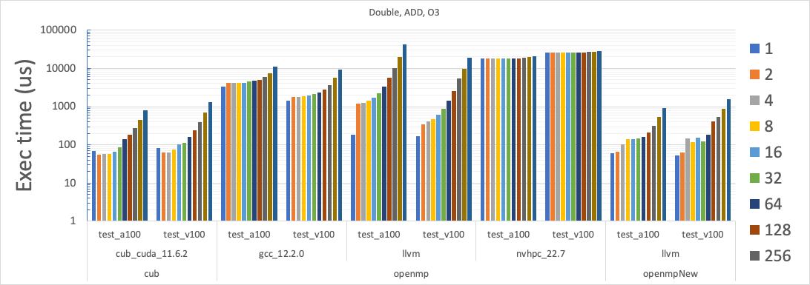

### 2022, Oct 26

Agenda

  * [Optimized reduction implementation by Greg](https://www.google.com/url?q=https://drive.google.com/drive/folders/1d2xrH1UYVqKl7ZrRvzR4Q8SA7Ov-BL_s&sa=D&source=editors&ust=1778600246248147&usg=AOvVaw2MWqZLA7wTVh-J0Oon1YAk)

  * [Review D126641](https://www.google.com/url?q=https://reviews.llvm.org/D136641&sa=D&source=editors&ust=1778600246248235&usg=AOvVaw0D4rP66YUsik_Su70TxzZK)

  * Reduction alternative:

  * [https://github.com/jdoerfert/llvm-project/blob/c4e637d2c94959ca493363b921aa226286188eb3/red.cpp#L201](https://www.google.com/url?q=https://github.com/jdoerfert/llvm-project/blob/c4e637d2c94959ca493363b921aa226286188eb3/red.cpp%23L201&sa=D&source=editors&ust=1778600246248449&usg=AOvVaw1UpeoBJKF_DxYYsNoPxX4u)
  * Reduction impl entry point: [https://github.com/jdoerfert/llvm-project/blob/c4e637d2c94959ca493363b921aa226286188eb3/openmp/libomptarget/DeviceRTL/src/Reduction.cpp#L2059](https://www.google.com/url?q=https://github.com/jdoerfert/llvm-project/blob/c4e637d2c94959ca493363b921aa226286188eb3/openmp/libomptarget/DeviceRTL/src/Reduction.cpp%23L2059&sa=D&source=editors&ust=1778600246248703&usg=AOvVaw1xceDfRxBlehU0-gjms5_P) 
  * 

  * [⚙ [OpenMP] Add non-blocking support for target nowait regions](https://www.google.com/url?q=https://reviews.llvm.org/D132005&sa=D&source=editors&ust=1778600246249545&usg=AOvVaw3n3HVqwnbDr9nOTayK1hMO)

  * OpenMP Cluster and MPI plugin
  * [Presented slides](https://www.google.com/url?q=https://docs.google.com/presentation/d/1yFaIanlR4JccYFhrKe_30k17LgjvyvC6DkOgc1Hum5c/edit?usp%3Dsharing&sa=D&source=editors&ust=1778600246249795&usg=AOvVaw3Sazvs1whibHTGSyfvlzUE)

  * Segmentation fault when a constant variable is used in a map clause

  * Caused by a copy-back from the device

  * [https://reviews.llvm.org/D135162](https://www.google.com/url?q=https://reviews.llvm.org/D135162&sa=D&source=editors&ust=1778600246250039&usg=AOvVaw0MEoa_--oj68HdHoHJWBgG)
  * Changing register requires

  * [https://reviews.llvm.org/D133539](https://www.google.com/url?q=https://reviews.llvm.org/D133539&sa=D&source=editors&ust=1778600246250187&usg=AOvVaw2y27WIP1cA4HDtxVsT05FS)

  * Replaces the `omp_register_requires` call with a global array registered the same way we handle globals / kernels
  * Requires breaking backwards compatibility

  * Could be made mostly backwards compatible, only losing support for unified shared memory in old executables.

  * Device destructors

  * By the time the host calls the destructor the plugin has been destructed.

  * Lifetime extending patch was reverted for AMD so this no longer works

  * Make the plugins handle it directly

  * New libomptarget plugin infrastructure 

  * [https://reviews.llvm.org/D134396](https://www.google.com/url?q=https://reviews.llvm.org/D134396&sa=D&source=editors&ust=1778600246250890&usg=AOvVaw2qRTfTwgK7EmyFp3C4wv8f)

  * OpenMP GPU Reduction
  * Number of arguments to parallel on device

  * [https://github.com/llvm/llvm-project/issues/56389](https://www.google.com/url?q=https://github.com/llvm/llvm-project/issues/56389&sa=D&source=editors&ust=1778600246251098&usg=AOvVaw1qbsKOmxVeYbimwjlQ11Jg)
  * -> [https://reviews.llvm.org/D102107](https://www.google.com/url?q=https://reviews.llvm.org/D102107&sa=D&source=editors&ust=1778600246251215&usg=AOvVaw0sr--CUOwCM-1aKK1Vq2Go) 

  * OMPD (Vignesh)

  * [https://reviews.llvm.org/D100185](https://www.google.com/url?q=https://reviews.llvm.org/D100185&sa=D&source=editors&ust=1778600246251363&usg=AOvVaw1SFx8KWRrr3o_3aUNOGhoT) (gdb plugin) - landed!

  * Breaks many builds by adding dependencies no required by LLVM

  * [https://reviews.llvm.org/D100186](https://www.google.com/url?q=https://reviews.llvm.org/D100186&sa=D&source=editors&ust=1778600246251550&usg=AOvVaw1DL1vWRuJp6PQgjU0NYwL-) (ompd tests based on gdb plugin)
  * (Joachim) Can we enable OMPD_SUPPORT by default, if OMPT_SUPPORT is enabled?

  * Allocators - managed memory missing on AMD

  * Does AMD have support?
  *  if managed means migratable, maybe. Might be platform dependent and involve the plugin setting an environment variable read by HSA.

  * Dynamic shared memory

  * [https://openmp.llvm.org//design/Runtimes.html#libomptarget-dynamic-shared](https://www.google.com/url?q=https://openmp.llvm.org//design/Runtimes.html%23libomptarget-dynamic-shared&sa=D&source=editors&ust=1778600246252093&usg=AOvVaw1yINHNJi4LbxPf8pJ15GhD) 
  * Add dynamic memory and stream like with <<< >>> in cuda
  * [https://reviews.llvm.org/D125252](https://www.google.com/url?q=https://reviews.llvm.org/D125252&sa=D&source=editors&ust=1778600246252273&usg=AOvVaw2yuan0IYuhuMn1HXV81Uoh) only adds the plugin runtime support

  * Meta directive 

  * [https://reviews.llvm.org/D122255](https://www.google.com/url?q=https://reviews.llvm.org/D122255&sa=D&source=editors&ust=1778600246252474&usg=AOvVaw15G-KZkuU31Bgh8vJ2pl-z)

  * OMPT target patches needing review. Top of stack [⚙ D127372 [OpenMP] [OMPT] [8/8] Added lit tests for OMPT target callbacks (llvm.org)](https://www.google.com/url?q=https://reviews.llvm.org/D127372&sa=D&source=editors&ust=1778600246252659&usg=AOvVaw322ZtVkf8P4xwaHf4aq33B)
  * Updating default version to 5.1 [ready, waiting for more features]

  * [D129635](https://www.google.com/url?q=https://reviews.llvm.org/D129635&sa=D&source=editors&ust=1778600246252820&usg=AOvVaw2gRAhmYUvbZWV_neS2L2TX): [OpenMP] Update the default version of OpenMP to 5.1 [Accepted]
  * [OpenMP Support -- Clang 16.0.0git documentation](https://www.google.com/url?q=https://clang.llvm.org/docs/OpenMPSupport.html%23openmp-5-1-implementation-details&sa=D&source=editors&ust=1778600246253011&usg=AOvVaw0hrE0rhZGDZwFgHEJaj6Ht) 

  * _OPENMP (Joachim)

  * Currently 201811 (= 5.0)

###
