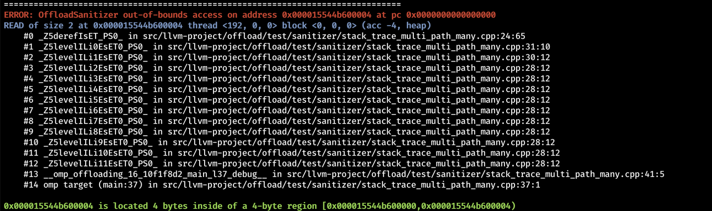

### 2024, Sep 11

Agenda 

New 

  * Question: LLVM_ENABLE_RUNTIMES=openmp vs LLVM_ENABLE_PROJECT=openmp builds, which one is preferred?

  * For host openmp runtime
  * RUNTIME build is expected to work.

  * Built libc++.a and libc++abi.a for the GPU

  * [https://discourse.llvm.org/t/rfc-building-libc-for-gpu-targets/80216](https://www.google.com/url?q=https://discourse.llvm.org/t/rfc-building-libc-for-gpu-targets/80216&sa=D&source=editors&ust=1778600246007919&usg=AOvVaw2l21HDJsYj_OOg_ir1Za9U)
  * Already merged, looking to get it built on the bots, nothing more to add

  * ARB will vote to produce JSON files (for us to use)

  * Proposed the generate to make it stable for outside consumer
  * Krzysztof and Johannes offer to be maintainer of the script

  * Thin-LTO for AMD GPU (modules without external calls):

  * [https://github.com/jdoerfert/llvm-project/tree/thin_lto](https://www.google.com/url?q=https://github.com/jdoerfert/llvm-project/tree/thin_lto&sa=D&source=editors&ust=1778600246008423&usg=AOvVaw3QATe3dfClIXBLJUhat71j)

  * Target data as a task generating construct

  * One of the changes for OpenMP 6.0
  * This includes support for "nogroup" (target data now has an implicit taskgroup, too)

  * Compound/composite constructs in Flang (and Clang)

  * OpenMP spec expose json files in some format that can be used by llvm (see above)
  * PR for exporting OpenMP definitions: [https://github.com/OpenMP/spec/pull/3943](https://www.google.com/url?q=https://github.com/OpenMP/spec/pull/3943&sa=D&source=editors&ust=1778600246008920&usg=AOvVaw2Nlml5sA6vxE4sn-0QOZCx) 
  * Almost done with sema; now working on directive breakdown.
  * We might have to auto-gen tests to tame the combinatorial number of tests required.
  * Flang w/ MLIR should be less critical.  TBC.
  * Clang is more monolithic and thus could more easily break

  * Cooperative Kernel launch via HSA?

  * Posted as a question.
  * Asked around at AMD to no avail yet.

  * Kernel library shipped with Offload
  * GPUSan WIP

  * [https://github.com/jdoerfert/llvm-project/tree/gpu_san](https://www.google.com/url?q=https://github.com/jdoerfert/llvm-project/tree/gpu_san&sa=D&source=editors&ust=1778600246009650&usg=AOvVaw3fUJqOuEc_s2y6NCRuLPqQ)
  * -fsanitize=offload
  * Feedback welcome, very much WIP!

  * OpenMP version 5.2 as default

  * Could go straight to 6.0 and not bother with 5.2 at all
  * Older review that made a move from 5.0 to 5.1 [https://reviews.llvm.org/D129635](https://www.google.com/url?q=https://reviews.llvm.org/D129635&sa=D&source=editors&ust=1778600246010025&usg=AOvVaw38ctDDNWiveiBMju9mtRz1) 
  * Where are we right now regarding documents, such as what features are supported and what are not?
